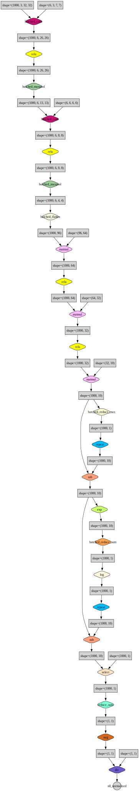
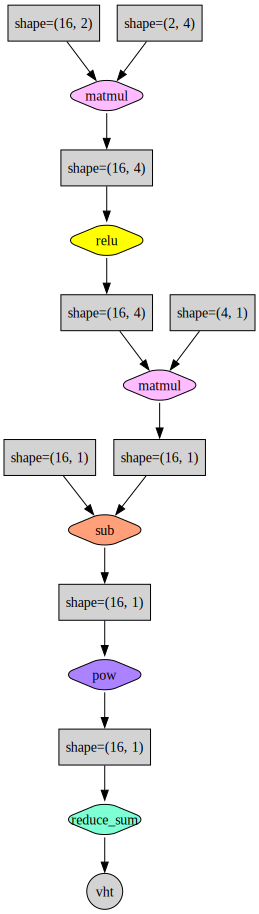

# tiny-torch

<!-- | Conv-Net                               | MLP                                   |
|:-------------------------------------:|:-------------------------------------:|
|  |  | -->

## Conv-Net


```sh
rm generated/*
# define and train Conv-Net
nvcc models/conv_net.cu && ./a.out
# visualize model graph
cat generated/graph.txt | dot -Tsvg -o generated/conv_net.svg
```

## MLP


```sh
rm generated/*
# define and train MLP
nvcc models/mlp.cu && ./a.out
# visualize model graph
cat generated/graph.txt | dot -Tsvg -o generated/mlp.svg
```
